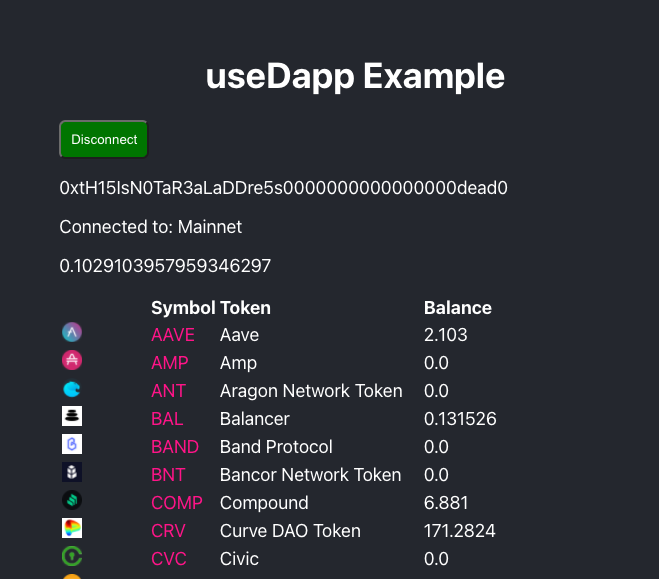

# useDapp Example

Deployed: [usedapp-example.vercel.app](https://usedapp-example.vercel.app/)

## Notes

* `DAppProvider` - wraps application to manage all blockchain connections.
    * config parameters:
        * `readOnlyChainId`: default chain in readonly mode
        * `readOnlyUrls`: object mapping for ChainId to JSON RPC url
* `useEthers`: hook for connected-related modules e.g. chainId, account and [`ethers`](ethers.io) lib

## References

* [usedapp.io](https://usedapp.io/)
* [Ethworks Medium](https://medium.com/ethworks/introducing-usedapp-framework-for-rapid-dapp-development-4959361f242a)
* [useDapp ReadTheDocs](https://usedapp.readthedocs.io/)
* [ethers/ethersproject docs](https://docs.ethers.io/)
